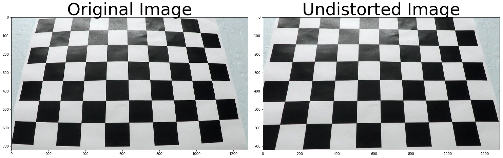
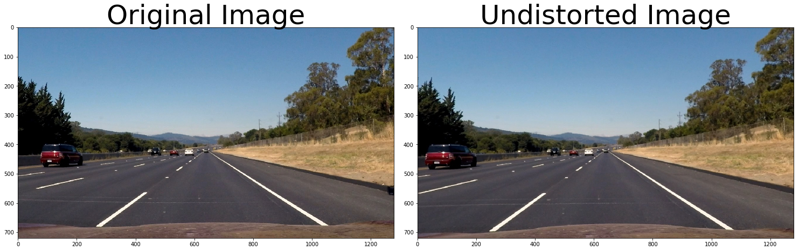
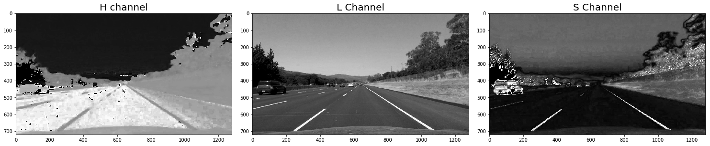
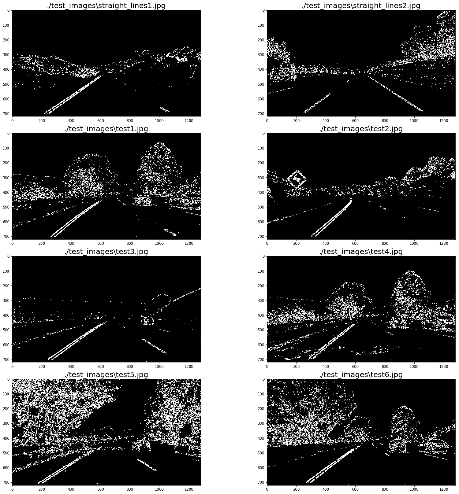
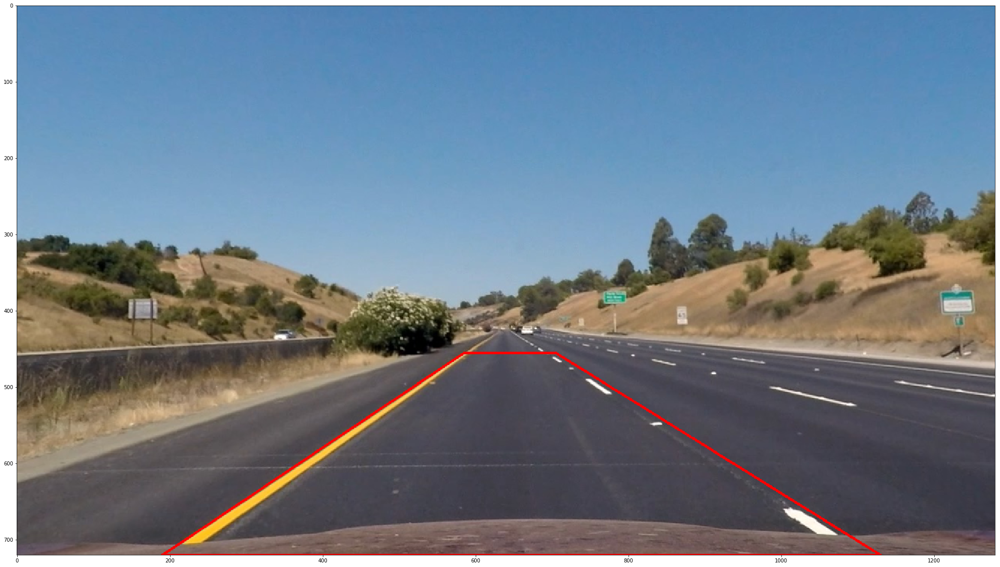
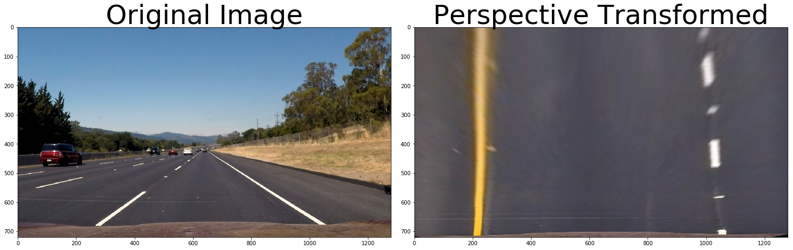
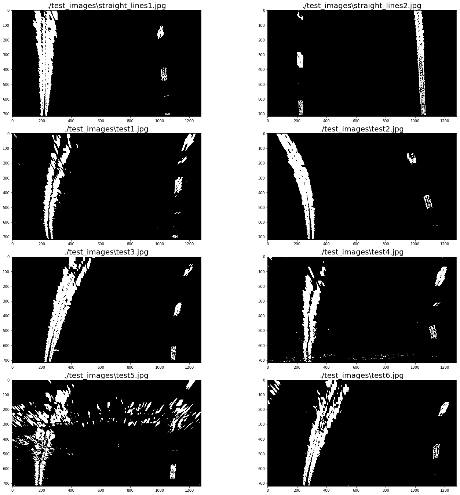
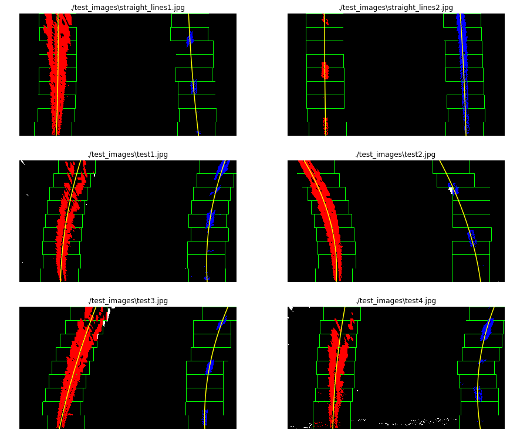
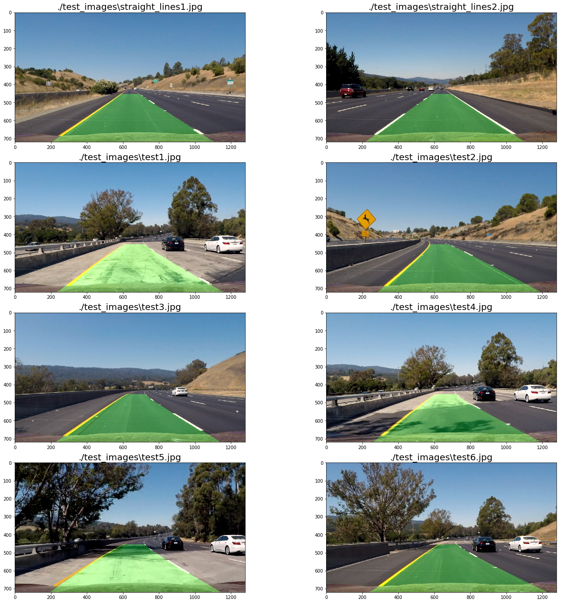
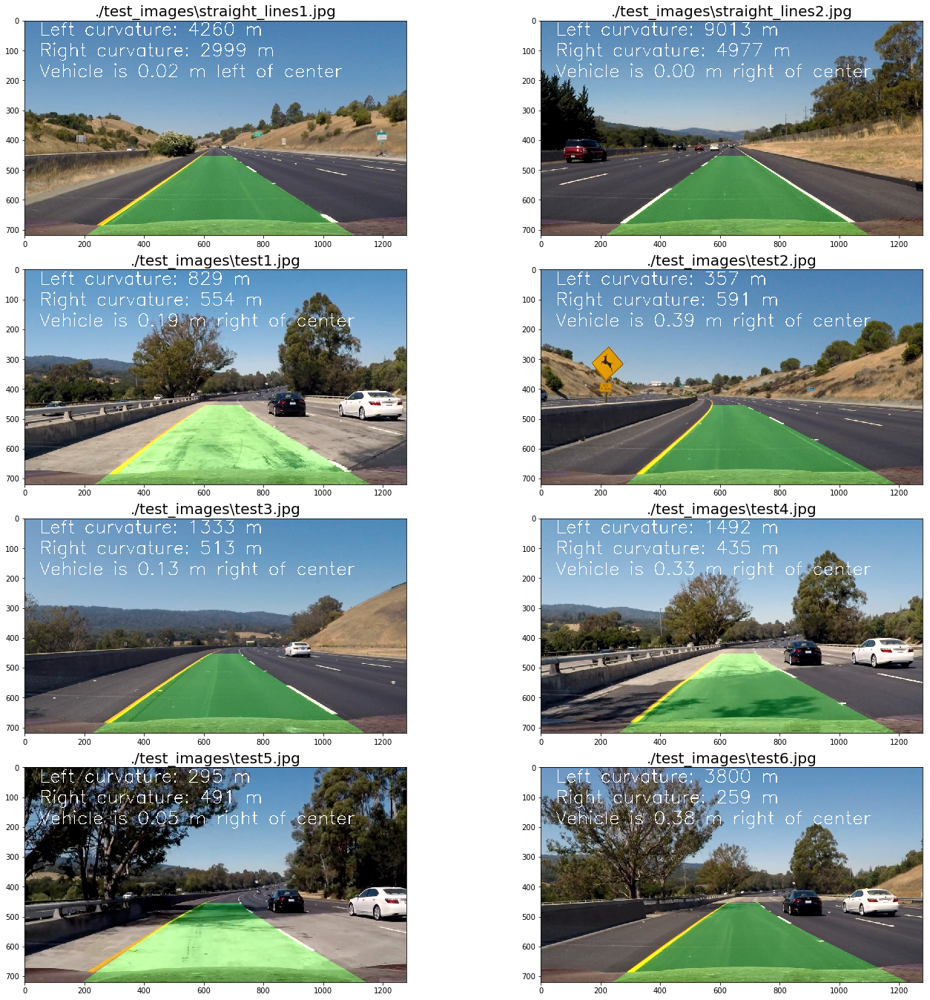

## Advanced Lane Finding

---
This is the second project of **Udacity Self Driving Car Engineer Nanodegree** 
The goals / steps of this project are the following:

* Compute the camera calibration matrix and distortion coefficients given a set of chessboard images.
* Apply a distortion correction to raw images.
* Use color transforms, gradients, etc., to create a thresholded binary image.
* Apply a perspective transform to rectify binary image ("birds-eye view").
* Detect lane pixels and fit to find the lane boundary.
* Determine the curvature of the lane and vehicle position with respect to center.
* Warp the detected lane boundaries back onto the original image.
* Output visual display of the lane boundaries and numerical estimation of lane curvature and vehicle position.

---

### Camera Calibration

Camera calibration code can be found at [Camera_Calibration.ipynb](https://github.com/dhruboj/CarND-Advanced-Lane-Lines/blob/master/Camera_Calibration.ipynb). By using `cv2.findChessboardCorners`, the camera object and image points are stored in an array `objpoints` and `imgpoints`. Then the `objpoints` and `imgpoints` are used to compute the camera calibration and distortion coefficients using the `cv2.calibrateCamera` function. Then the distortion correction is applied into the test image using the `cv2.undistort` function and below result is obtained:

The camera calbration `mtx` and `dist` value is stored using `pickle` and used in the [final notebook](https://github.com/dhruboj/CarND-Advanced-Lane-Lines/blob/master/Advanced_Lane_Lines.ipynb)

### Pipeline 

#### distortion-corrected image

By using the camera calibration `mtx` and `dist` value the following undistorted image is obtained by applying the calibration to one of the test images:

### Creation of thresholded binary image

A color transformation is performed and the S channel is selected  as it shows more visibility on the lane lines as shown in the below image:

On the S channel image below gradients are calculated

- Sobex X and Sobel Y
- Magnitude
- Gradient Direction
- Combination of all the abobe

The combination of Sobel X and Sobel Y is used to continue with the pipeline. Below images list are the binary image obtained with the applied combination of Sobel X and Sobel Y on the test images provide:

### Perspective Transform

For the perspective transform the image used is the onw with straight lane lines. Four points are selected on that image as the source of the perspective transform. The points are hihglighted in the below image:

The destination points for the transformation are listed below:

**Source** | **Destination**
-----------|----------------
(585, 455) | (200,0)
(705, 455) | (maxX - 200, 0)
(1130, 720)| (maxX - 200, maxY)
(190, 720) | (200, maxY)

By using `cv2.getPerspectiveTransform` a transformation matrix was calculated, and an inverse matrix is also calculated to map the points back to the original place. The result of the transformation on the test image is displayed below:

Below are the binary pictures after the persfective transform on all the test images:

### Lane Pixel Identification

The line detection code could be found inside `findLines` function. The algorithm calculates the histogram in x-axis. Finds the picks on the right & left side of the image and collect the non zero points. When all points are collected a polynomial fit is used by using `np.polyfit()` method to find the line model. Another polynomial fit is done on the same points transforming pixels to meters to be used in curvature calculations later in the notebook. Below are the images showing the points found. 

### Radius of Curvature and the Position of the Vehicles on the center

In the previous step a polynomial was calculated on the meters space and is used here to calculate the curvature. The formula is:

`((1 + (2*fit[0]*yRange*ym_per_pix + fit[1])**2)**1.5) / np.absolute(2*fit[0])`

where fit is the the array containing the polynomial, yRange is the max Y value and ym_per_pix is the meter per pixel value.

Vehicle position can be found by:

- Calculate the lane center by evaluating the left and right polynomials at the maximum Y and find the middle point.
- Calculate the vehicle center transforming the center of the image from pixels to meters.
- The sign between the distance between the lane center and the vehicle center gives if the vehicle is on to the left or the right.

Below images are the drawn lane line images:

To display the lane lines on the image, the polynomials where evaluated on a lineal space of the Y coordinates. The generated points where mapped back to the image space using the inverse transformation matrix generated by the perspective transformation. The following images are examples of this mapping:

## Pipeline(Video)

After some refactoring of the code by defining a new class the video is processed and stored in the `my_video_output` folder.

## Discussion

- In perspective transform automatic point detection can be implemented in future.
- Few more areas a new functions can be defined in the code to avoid repeat calculations
- In the challenge video this pipeline is performing worst, so have to make some adjustment to make it more robust.